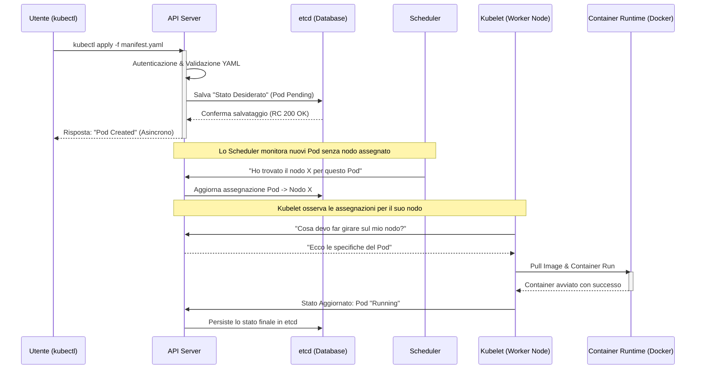

# Ciclo di vita: Dall'Apply al Deployment

Quando eseguiamo un comando per lanciare un'applicazione, Kubernetes non si limita a "eseguire un file", ma avvia un processo orchestrato di riconciliazione tra lo stato desiderato e quello reale.

## Sequence Diagram: Il Flusso della Richiesta

Ecco cosa succede "sotto il cofano" quando esegui un `kubectl apply`. Il diagramma mostra il caso di successo (Happy Path) che culmina con il deployment sul Worker Node.

## Fasi Dettagliate

### 1. Fase di Ingresso (API Server)

L'API Server è l'unico componente autorizzato a scrivere su **etcd**. Quando riceve lo YAML, verifica che tu abbia i permessi e che la sintassi sia corretta. Se tutto va bene, risponde immediatamente a `kubectl` con un codice 200/201. **Attenzione:** Questo non significa che il container è già attivo, ma solo che K8s ha preso in carico la richiesta.

### 2. Fase di Decisione (Scheduler)

Il Pod esiste in etcd ma è in stato `Pending`. Lo **Scheduler** entra in gioco: analizza le risorse richieste (CPU/RAM) nel manifest e le confronta con la disponibilità dei vari nodi. Una volta scelto il nodo, comunica la decisione all'API Server.

### 3. Fase di Esecuzione (Kubelet & Runtime)

La **Kubelet** sul worker node scelto è in costante ascolto (watch). Appena vede che un Pod le è stato assegnato:

1. Chiama il **Container Runtime** (es. Docker/containerd).
2. Scarica l'immagine dal registry.
3. Avvia i container.
4. Esegue i probe di salute (Liveness/Readiness).

---

## Il "Reconciliation Loop": La vera magia

Kubernetes non finisce il suo lavoro una volta avviato il Pod. Il **Controller Manager** esegue un ciclo continuo:

> **Stato Desiderato (etcd)** VS **Stato Reale (osservato da Kubelet)**

Se un nodo fallisce e lo stato reale scende a 0 Pod mentre etcd dice 1, Kubernetes avvia automaticamente un nuovo ciclo per riportare il sistema in equilibrio. Questo rende K8s un sistema **Self-Healing** (auto-riparante).

---

## kubectl: Il nostro telecomando

Per interagire con questo flusso usiamo `kubectl`.
*Requisito:* Il file `~/.kube/config` (kubeconfig) deve contenere l'indirizzo dell'API Server e i certificati per l'autenticazione.

### Tabella dei Comandi Essenziali per il Debug

| Comando | Livello di Dettaglio | Quando usarlo? |
| --- | --- | --- |
| `kubectl get pods` | Alto (Sintetico) | Per un controllo rapido del tipo "è acceso o spento?" |
| `kubectl describe pod <nome>` | Molto Alto | Fondamentale se il Pod è in `CrashLoopBackOff` o `Pending`. Leggi la sezione **Events** in fondo. |
| `kubectl logs <nome>` | Interno | Per leggere gli errori dell'applicazione (es. eccezioni Java o errori Python). |
| `kubectl exec -it <nome> -- sh` | Interattivo | Per "entrare" nel container e verificare file system o connettività di rete. |
| `kubectl delete -f file.yaml` | Distruttivo | Per rimuovere tutte le risorse definite nel manifest. |

---